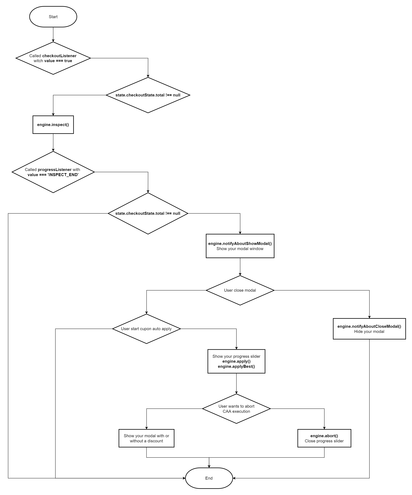

## Demo capabilities

Demo extension works with five merchants only – ASOS, MyProtein, Shein, Dell and Emma

## SmartShopping SDK

### Installation

`npm i smartshopping-sdk`
`yarn add smartshopping-sdk`

### Integration

"storage", "tabs" and "alarms" permissions required

#### Background script

Background script of extension using **SmartShopping SDK** might look like this:

```
import { bootstrap } from 'smartshopping-sdk';
import { requirePromocodes} from '../utils';

const { install, startEngine, sendCodes } = bootstrap({ clientID: 'demo', key: 'very secret key' });

chrome.runtime.onInstalled.addListener(() => {
  install();
});
chrome.tabs.onUpdated.addListener(async (tabId, changeInfo) => {
  if (changeInfo.status === 'complete') {
    startEngine(tabId);
  }
});
chrome.tabs.onReplaced.addListener(async (tabId) => {
  startEngine(tabId);
});
chrome.runtime.onMessage.addListener(
  async (message, sender) => {
    const tabId = sender?.tab?.id;
    if (!tabId) {
      return;
    }

    if (message.type === 'ready_to_CAA') {
      const codes = await requirePromocodes(tabId);
      if (codes.length) {
        sendCodes(tabId, codes);
      }
    }
  }
);
```

`bootstrap` takes three arguments – client ID, secret key (which is used for data decryption) and optional - serverUrl (not used by default). If you dont know your ID and secret key, contact **SmartShopping** tech support

It returns three functions:

- `install: () => Promise<void>` uploads and stores merchants data; also sets up message passing between background and content parts of **SmartShopping**.

- `startEngine: (tabId: number) => Promise<void>` identifies merchant in an active tab, uploads corresponding config and initializes `Engine` in a content script.
  Takes browser tab ID as an argument.

- `sendCodes: (tabId: number, codes: string[]) => void` sends to the `Engine` a list of coupons
  Takes browser tab ID and array of promo codes as an arguments

In the example above `requirePromocodes` is a function defined by host extension, responsible for finding promocodes which will be passed to `sendCodes`.

#### Content Script

In a content script you need to import and create an `Engine` instance:

```
import { Engine } from 'smartshopping-sdk';

const engine = new Engine();
```

`engine` receives config object from background script and manages coupon autoapply flow or detect a successful coupon.

Coupon autoapply flow stages:

1. `engine.inspect()` – analyzing checkout page and collecting information;

2. `engine.apply()` – applying promocodes and storing results into internal execution context;

3. `engine.applyBest()` – choosing and applying best promocode;

All three stages can be executed consistently via `engine.fullCycle()`.

Detect stage - `engine.detect()` – detects if a user tried to apply a coupon;

The execution of the stages: `detect`, `apply`, `applyBest` can be aborted using the `engine.abort()` method.

Since it is up to you to show the modal window with the suggestion to apply coupons, call the `engine.notifyAboutShowModal()` method before it is shown so that we can get these statistics.

And if the user closes the modal prompting them to apply codes, call the `engine.notifyAboutCloseModal()` method.

When a user tries to apply a third-party coupon, you can show them a modal window notifying them that they are trying to apply a third-party coupon, to collect statistics you can use methods:

1. `notifyAboutShow3dPartyModal` - when opening the modal window;

2. `notifyAboutClose3dPartyModal` - when closing the modal window;

3. `notifyAboutReactivate3dParty` - when reactivating coupon (if you want to offer a user to reactivate a coupon);

Config object looks like this:

```
type EngineConfig {
  version: number;
  shopId: string;
  shopName: string;
  shopUrl: string;
  checkoutUrl: string;
  inspect: Array<Command>;
  detect: Array<Command>;
  apply: Array<Command>;
  applyBest: Array<Command>;
  selectorsToCheck: Array<string>;
}
```

- `version` – version of config spec for intrinsic usage

- `shopId` – merchant's unique ID in **SmartShopping** database

- `shopName` – merchant's name

- `shopUrl` – RegEx matching all merchant's URLs

- `checkoutUrl` – RegEx matching merchant's checkout page

- `detect` – arrays of commands to detect and extract a successful coupon.

- `inspect`, `apply` and `applyBest` – arrays of commands for respective stages of auto apply flow.

- `selectorsToCheck` – array of selectors which are necessary to proceed. If any of them are invalid, execution stops with an error.

`engine` stores info in the following properties:

1. `config: EngineConfig`
   Config object
2. `progress: EngineProgress`
   Execution status

```
 type EngineProgress =
  | 'IDLE'
  | 'INSPECT'
  | 'INSPECT_END'
  | 'DETECT'
  | 'DETECT_END'
  | 'APPLY'
  | 'APPLY_END'
  | 'APPLY-BEST'
  | 'APPLY-BEST_END'
  | 'ERROR'
  | 'CANCEL';
```

3. `checkoutState: EngineCheckoutState`
   Info collected during `inspect` stage
   `checkoutState.total` – cart total before applying any codes

```
type EngineCheckoutState {
  total: null | number;
}
```

4. `finalCost: EngineFinalCost`
   This object contains pairs `"promocode": "cart total after applying promocode"`

```
type EngineFinalCost = { [key: string]: number }
```

5. `promocodes: Array<string>`
   Array of promocodes for testing
6. `currentCode: string`
   Promocode currently being processed
7. `detectState: EngineDetectState`
   Info collected during `detect` stage
   `detectState.userCode` - promocode entered by the user. If `detectState.userCode === 'UNDEFINED_CODE'` it means that we can't get the value of the code, but we know that it was entered
   `detectState.isValid` - validity of the code entered by the user. `true` if the code is successfully applied and `false` if the entered code turned out to be erroneous

  ```
  type EngineDetectState {
    userCode: string | 'UNDEFINED_CODE';
    isValid: boolean;
  }
  ```

8. `bestCode: string`
   Most profitable promocode
   If none of the codes worked, `bestCode === ''`
9. `checkout: boolean`
   Flag for being on checkout page

You can subscribe to those properties' changes via `engine.subscribe()`...

```
const unbinders = engine.subscribe(
    {
      config: configListener,
      checkoutState: checkoutStateListener,
      finalCost: finalCostListener,
      promocodes: promocodesListener,
      progress: progressListener,
      currentCode: currentCodeListener,
      bestCode: bestCodeListener,
      detectState: detectStateListener,
      checkout: checkoutListener,
    }
);
```

...and unsubscribe via `engine.ubsubscribe()`, passing return value of `engine.subscribe()` as an argument:

```
engine.unsubscribe(unbinders);
```

Subscribing for properties is optional so you may only choose ones you need and skip the rest:

```
const unbinders = engine.subscribe(
    {
      progress: listener1,
      currentCode: listener2,
      bestCode: listener3,
      checkout: listener4,
    }
);
```

`listener`-functions look like this:

```
listener: (value: %property_type%, state: EngineState) => void;

interface EngineState {
  checkoutState: EngineCheckoutState;
  finalCost: EngineFinalCost;
  progress: EngineProgress;
  config: EngineConfig;
  promocodes: Array<string>;
  bestCode: string;
  currentCode: string;
  detectState: EngineDetectState;
  checkout: boolean;
}
```

<details>
  <summary>Flowchart of an example of integrating Smartshopping SDK into your extension</summary>
  
  
  
</details>
